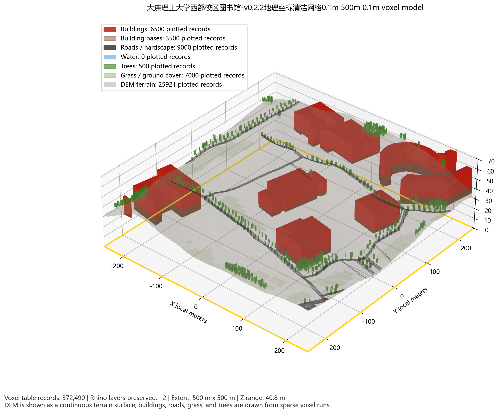
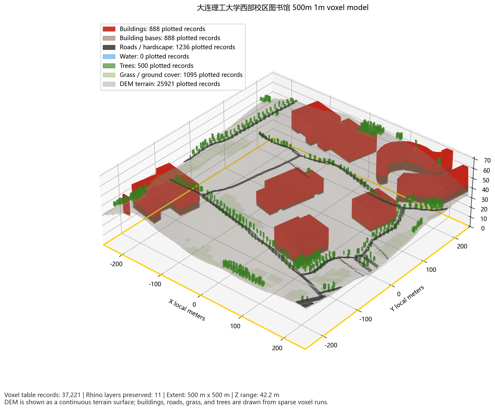
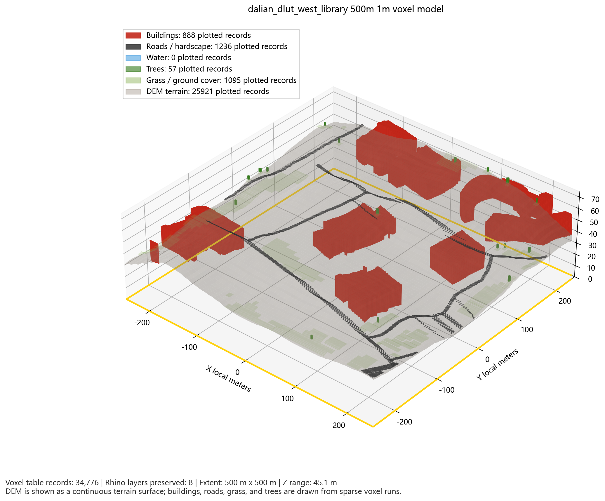
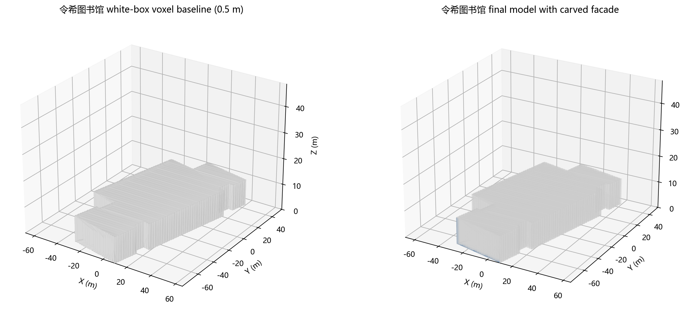

# VoxCity Open Streetview Facade - DUT Library

This repository maintains a VoxCity-derived research workflow for generating
all-element built-environment voxel models from one coordinate. The current
validated reference site is the west-campus library area of Dalian University of
Technology (DUT), exported as a Rhino-readable `.3dm` model with terrain,
vegetation, roads, buildings, semantic layers, morphology indicators, LCZ
classification, and first-pass heat-wind compound risk tables.

The immediate goal is not to publish a decorative 3D scene. The goal is to keep
an auditable, reproducible urban-base model pipeline that can later support
street-view-driven facade carving and CityLBM simulation.

## Current Achievements

Validated on 2026-07-22:

- Reference site: Dalian University of Technology west-campus library.
- Center: `38.8831553, 121.5120457` in WGS84.
- AOI: `500 m x 500 m`.
- Voxel size: `0.1 m`.
- Main Rhino file for v0.2.2:
  `outputs_citylbm_voxel_china/_manual_dalian_dlut_west_library_clean_geo_v0p2p2_0p1m/05_rhino/final_city_voxel_0p1m.3dm`.
- v0.2.1 1 m component-mesh Rhino export is kept as a lighter comparison:
  `outputs_citylbm_voxel_china/dalian_dlut_west_library_component_mesh/05_rhino/final_city_voxel_1m.3dm`.
- v0.2.0 unit-box Rhino export is kept as a legacy comparison:
  `outputs_citylbm_voxel_china/dalian_dlut_west_library/05_rhino/final_city_voxel_1m_v0p2p0.3dm`.
- Review screenshot:
  `10_figures_tables/versioned_screenshots/2026-07-22_v0.2.2_dut_library_clean_geo_0p1m.png`.
- Strict real-data status: passed.
- Site QA status: passed.
- Morphology/LCZ/risk quality status: passed.
- Lightweight runner tests and tiny E2E smoke test: passed.
- Previous full strict stability gate: passed on 2026-07-13 with `23`
  checks, no failed, warning, or skipped checks.

Reference model statistics:

| Item | Value |
| --- | ---: |
| Buildings | 8 |
| Roads | 13 |
| Water features | 0 |
| Green/vegetation polygons | 27 |
| Building footprint area | 36,488.733 m2 |
| Mean building height | 15.938 m |
| Max building height | 16.5 m |
| Green polygon area | 28,173.206 m2 |
| DEM source | aws_terrarium |
| DEM elevation range | 32.027 m |
| Sparse voxel runs | 372,490 |
| Equivalent represented voxels | 802,692,253 |
| Rhino objects | 53 |
| Rhino layers | 12 |
| Rhino building groups | 9 |
| Rhino building meshes | 18 |
| Semantic component mesh objects | 4 |
| Building 0.1 m unit voxel boxes exported | 0 in default v0.2.2 mode |
| Building/base topology-clean shell objects | 18 |
| Mesh objects with hidden Rhino wire display | 22 |
| Geographic coordinate text dots | 8 |
| Rhino file size | 49.14 MB |
| v0.2.0 unit-box Rhino file size | 64.94 MB |
| LCZ/morphology text dots | 9 |
| 250 m morphology grid rows | 4 |
| 250 m LCZ rows | 4 |
| 250 m heat-wind risk rows | 4 |

Semantic Rhino/voxel layers:

| Layer | Represented voxels |
| --- | ---: |
| `01_Buildings_0p1m_Voxels` | 570,973,980 |
| `01a_Building_Bases_0p1m_Voxels` | 168,727,755 |
| `02_Roads_Hardscape_0p1m_Voxels` | 2,508,308 |
| `04_Green_Trees_0p1m_Voxels` | 29,850,967 |
| `05_Green_Grass_0p1m_Voxels` | 5,631,243 |
| `06_Terrain_DEM_0p1m_Voxels` | 25,000,000 |

Current whole-scene classification:

- LCZ primary: `LCZ 9 - Sparsely built`.
- LCZ alternatives: `LCZ 2 - Compact mid-rise`, `LCZ 5 - Open mid-rise`.
- LCZ confidence: `0.62`.
- ALCC type: `mixed_open_built_green_environment`.
- Interpretation: low-to-moderate building fraction, mid-rise building height,
  substantial terrain relief, and meaningful green/grass cover.

The LCZ module is a transparent first-pass classifier for design reference and
screening. Publication-grade LCZ claims still require calibration against
official LCZ training samples or manually reviewed local samples.

## Rhino Voxel Export Note

The current reference grid resolution is `0.1 m`. Earlier Rhino previews could look like
long cuboids because the exporter merged consecutive equal-layer voxels into
run-length meshes for performance. This is a storage/display optimization; the
underlying `sparse_voxels.csv` still records the represented voxel counts.

In v0.2.2, the default Rhino export mode is `component_mesh_groups`. The
voxelization and statistics still use the executed `0.1 m` grid, but Rhino
geometry is written as lighter component meshes: buildings are grouped per
building and exported as run-length merged voxel meshes, while terrain, roads,
grass, tree canopies, and water are exported as semantic component meshes. This
keeps the visible stair-step voxel boundary while avoiding hundreds of
millions of individual Rhino box objects.

The v0.2.2 Rhino export also adds `09_Geographic_Coordinate_Info`, with center,
bbox, local-axis, and corner WGS84/elevation text dots. Building and
building-base meshes use a merged run shell when their z-span is uniform, so
internal side faces are not written. Mesh wire display is hidden in Rhino for a
cleaner review model while the sparse voxel accounting remains available in
the output tables.

The older `building_voxel_groups` mode remains available when visual inspection
of every `1 m` building cube is needed. It is much heavier and should be used
only for small AOIs or debugging.

## Result Screenshot Gallery

The repository keeps screenshots in versioned paths so the current all-element
environment model is not confused with the earlier street-view/facade
experiment results.

| Date / version | Screenshot | What it shows | Status |
| --- | --- | --- | --- |
| `2026-07-22` / `v0.2.2_dut_library_clean_geo_0p1m` |  | Current recommended DUT west-campus library 500 m x 500 m all-element model. It uses 0.1 m voxel accounting, terrain-aware placement, semantic component meshes, topology-clean building/base shells, hidden Rhino mesh wires, and a geographic coordinate information layer. | Current reference result |
| `2026-07-21` / `v0.2.1_dut_library_component_mesh_groups` |  | DUT west-campus library 500 m x 500 m all-element model. It preserves the 1 m voxel grid in statistics while exporting buildings and context layers as lighter Rhino component meshes. | Legacy lighter 1 m result |
| `2026-07-21` / `v0.2.0_dut_library_1m_rhino_groups_lcz_street_trees` |  | DUT west-campus library 500 m x 500 m all-element model with DEM terrain, 1 m building unit-box export, per-building Rhino groups, LCZ/morphology text layer, and road-centerline-derived street trees. | Legacy heavy Rhino export |
| `2026-07-13` / `v6_dut_library_all_element_voxel_model` |  | Earlier DUT west-campus library 500 m x 500 m all-element model with terrain, vegetation, roads, buildings, semantic layers, morphology, LCZ, and heat-wind risk outputs. | Legacy comparison result |
| `2026-07-09` / `v1_manual_multiview_facade_result` |  | Earlier manual multiview/street-view facade experiment focused on one confirmed real-data view and facade carving evidence. | Legacy comparison result |

## Version History

| Version | Main capability | Reference site or scope | Data sources | Output status | Key limitation |
| --- | --- | --- | --- | --- | --- |
| `v0_original_voxcity` | Original VoxCity exploratory workflow and Singapore-style reference reproduction | Original VoxCity examples | Upstream VoxCity-supported sources | Preserved for traceability | Not yet adapted to Chinese offline data, Rhino layer QA, or DUT case requirements |
| `v1_osm_whitebox` | Coordinate-based OSM building/road model and simple Rhino export | Dalian campus and urban test points | OSM/Overpass plus procedural fallback | Useful for early geometry checks | Close to a traditional white-box model; weak vegetation, terrain, and source QA |
| `v2_all_element_real_data` | All-element scene model with buildings, roads, water, vegetation, terrain, POI, sparse voxels, and Rhino layer colors | Zhongshan Square and DUT test sites | OSM cache, ESA WorldCover 2021, aws_terrarium DEM | Full-element modeling achieved | Large artifacts need release-asset handling; LCZ still first-pass |
| `v3_dut_library_reference` | Stable 500 m x 500 m DUT library reference model at 1 m voxel size | DUT west-campus library | OSM cache, ESA WorldCover 2021 local GeoTIFF, aws_terrarium DEM | Current recommended reference output; QA passed | Street-view facade carving not enabled yet |
| `v4_morphology_lcz_risk_mvp` | 250 m morphology indicator extractor, rule LCZ, prototype-distance probabilistic LCZ, heat-wind compound risk, typical-block export | DUT library 4-grid reference table | VoxCity semantic layers plus DEM-derived terrain metrics | Sequential notebook workflow and quality report passed | LCZ probabilities are low-confidence until calibrated |
| `v5_release_stability_gate` | Strict source-readiness, WorldCover/DEM/OSM validation, tiny/multi-site/cross-China E2E checks, Git release audit | Dalian multi-site and Beijing/Shanghai/Chengdu/Shenzhen/Urumqi/Harbin probes | Real-data caches, no fallback allowed in strict mode | Full strict gate passed on 2026-07-13 | Runtime depends on available local caches or network for new sites |
| `v6_streetview_facade_phase1` | Legal manual street-view metadata contract, facade-plane extraction, image-to-facade matching scaffold | Manual/self-captured or licensed imagery only | No restricted street-view API calls | Phase 1 scaffold implemented and validated | No automatic facade carving yet; segmentation/depth/carving are next-stage work |
| `v0.2.0_rhino_building_groups_lcz_street_trees` | 1 m default voxel modeling, building unit-voxel Rhino export, per-building Rhino groups, LCZ/morphology text layer, and configurable road-centerline street trees | DUT west-campus library 500 m x 500 m | OSM cache, ESA WorldCover 2021 local GeoTIFF, aws_terrarium DEM | Formal DUT site run and QA passed on 2026-07-21 | Non-building context layers remain run-length merged meshes for Rhino performance; street-tree layout is an engineering proxy until field/tree inventory calibration |
| `v0.2.1_component_mesh_groups` | 1 m voxel accounting with lighter Rhino component mesh export, per-building Rhino groups, semantic context meshes, and unchanged morphology/LCZ/risk outputs | DUT west-campus library 500 m x 500 m | OSM cache, ESA WorldCover 2021 local GeoTIFF, aws_terrarium DEM | Formal DUT component-mesh run and QA passed on 2026-07-21 | Meshes preserve 1 m stair-step boundaries but do not expose every voxel as an individual editable Rhino box |
| `v0.2.2_clean_geo_0p1m` | 0.1 m voxel accounting, geographic coordinate information layer, topology-clean building/base shells, hidden Rhino mesh wires, semantic component meshes, and unchanged morphology/LCZ/risk outputs | DUT west-campus library 500 m x 500 m | OSM cache, ESA WorldCover 2021 local GeoTIFF, aws_terrarium DEM | Formal DUT 0.1 m clean-geo run and QA passed on 2026-07-22 | Full 0.1 m accounting is large; Rhino geometry remains grouped component meshes rather than editable per-voxel boxes |

## What This Project Can Do Now

Given one WGS84 or GCJ-02 coordinate in China, the current runner can:

1. Normalize the coordinate to WGS84.
2. Build a local metric AOI and voxel grid.
3. Prepare/check real data sources before formal modeling.
4. Fuse OSM buildings, roads, water and POI with ESA WorldCover vegetation and
   aws_terrarium DEM terrain.
5. Export a Rhino `.3dm` file with semantic layers and inherited layer colors.
6. Export sparse voxel CSVs and Rhino object-to-voxel mapping tables; buildings
   can be grouped per building in Rhino, with `component_mesh_groups` as the
   recommended default for practical file size.
7. Compute 250 m morphology indicators covering base info, building form,
   openness, ventilation proxies, blue-green space, and terrain.
8. Run rule-based and prototype-distance LCZ classification with probability,
   top1/top2 margin, entropy, and confidence level.
9. Run first-pass heat-wind compound risk scoring and export typical blocks for
   downstream CityLBM selection.
10. Render review screenshots and run strict QA.

Strict mode rejects formal output when DEM, WorldCover, or OSM falls back to
synthetic/empty data. Preview fallback exists only for debugging and must not be
used as research evidence.

## Repository Layout

```text
.
├─ src/
│  ├─ china_voxel_pipeline.py
│  ├─ streetview_facade/
│  └─ urban_morphology/
├─ scripts/
│  ├─ run_site_model.py
│  ├─ qa_site_output.py
│  ├─ run_stability_checks.py
│  ├─ prepare_github_release.py
│  └─ test_*.py
├─ config/
│  └─ lcz_thresholds.json
├─ docs/
├─ notebooks/
│  ├─ 01_study_area_grid_prepare.ipynb
│  ├─ 02_voxcity_semantic_layers_check.ipynb
│  ├─ 03_morphology_indicator_extraction.ipynb
│  ├─ 04_lcz_classification_uncertainty.ipynb
│  ├─ 05_heat_wind_compound_risk.ipynb
│  └─ 06_visualization_typical_blocks_export.ipynb
├─ templates/
├─ outputs_citylbm_voxel_china/
├─ 10_figures_tables/
│  └─ versioned_screenshots/
├─ GITHUB_RELEASE_MANIFEST.md
└─ SOFTWARE_OPTIMIZATION_PLAN_VOXEL_CARVING.md
```

Generated output folders are intentionally excluded from normal Git history
unless they are small QA/statistics artifacts selected by the release staging
script. Rhino `.3dm`, GeoTIFF, GPKG, sparse voxel CSV, and raw caches should be
handled with Git LFS or GitHub Release assets.

## Install

Use Python 3.10+ where possible:

```powershell
python -m pip install -r requirements.txt
```

`rasterio` and `geopandas` can be sensitive on Windows. If normal `pip`
installation fails, use a conda environment for the geospatial stack, then
install `rhino3dm`, `requests`, and the remaining packages.

## Run The DUT Library Reference

```powershell
python scripts\run_site_model.py `
  --site-name dalian_dlut_west_library_clean_geo_v0p2p2_0p1m `
  --site-name-cn "DUT west-campus library clean geographic 0.1m AOI" `
  --lat 38.8831553 `
  --lon 121.5120457 `
  --input-crs WGS84 `
  --half-size-m 250 `
  --voxel-size-m 0.1 `
  --rhino-export-mode component_mesh_groups `
  --roadside-tree-spacing-m 10 `
  --roadside-tree-offset-m 2 `
  --roadside-tree-intersection-clearance-m 8
```

For a different Chinese site, change `--site-name`, `--lat`, `--lon`,
`--input-crs`, `--half-size-m`, and `--voxel-size-m`. Use `--dry-run` first to
inspect the normalized coordinate and output folder.

## Validate A Generated Site

```powershell
python scripts\qa_site_output.py `
  --output-root outputs_citylbm_voxel_china\dalian_dlut_west_library_clean_geo_v0p2p2_0p1m `
  --min-buildings 1 `
  --min-green-features 1 `
  --min-dem-relief-m 1.0 `
  --expected-lat 38.8831553 `
  --expected-lon 121.5120457 `
  --expected-aoi-width-m 500 `
  --expected-voxel-size-m 0.1 `
  --require-layer-token Buildings_ `
  --require-layer-token Roads_Hardscape_ `
  --require-layer-token Green_Trees_ `
  --require-layer-token Green_Grass_ `
  --require-layer-token Terrain_DEM_ `
  --require-real-data-sources
```

## Stability Gate

Default stability gate:

```powershell
python scripts\run_stability_checks.py --timeout-s 300
```

Full strict gate before publishing:

```powershell
python scripts\run_stability_checks.py --timeout-s 900 --strict-worldcover-coverage --include-tiny-e2e --include-multi-site-e2e --include-cross-china-e2e --strict-cross-china-real-data
```

The strict gate writes:

```text
outputs_citylbm_voxel_china/12_logs/stability_checks_summary.json
```

The 2026-07-13 strict gate passed with:

- `check_count = 23`
- `failed_checks = []`
- `warning_checks = []`
- `skipped_checks = []`
- `cross_china_e2e_probe = passed`
- `git_release_status_audit = passed`

## Prepare A Clean GitHub Staging Folder

```powershell
python scripts\audit_git_release_status.py
python scripts\audit_git_release_status.py --cleanup-plan-json _release\tracked_output_cleanup_plan.json
python scripts\prepare_github_release.py --target _release\voxcity-open-streetview-facade-dut-library_source
```

The staging folder is whitelist-based. It includes source code, documentation,
configuration, notebooks, templates, and small DUT library QA/statistics
artifacts. It excludes legacy smoke outputs and heavy model/data assets.

To prepare a local package that also contains large assets:

```powershell
python scripts\prepare_github_release.py --target _release\voxcity-open-streetview-facade-dut-library_with_assets --include-large-assets
```

Do not commit large assets to normal Git unless Git LFS has been explicitly
configured.

## Street-View Facade Carving Status

Street-view work is currently Phase 1 only:

- legal metadata schema for manual/self-captured/licensed images;
- provider allow-list and license/image existence audit;
- WGS84-to-local camera/facade coordinate helpers;
- building footprint edge extraction into facade planes;
- manual image-to-facade matching scaffold.

The code does not call restricted street-view APIs and does not fabricate facade
details. Automatic segmentation, depth alignment, facade-local carving
constraints, and voxel carving integration are planned next.

## Known Limits

- Building height is inferred from available OSM attributes or fallback rules;
  it is not yet a measured high-precision height source.
- ESA WorldCover is 10 m land-cover data. It improves vegetation/ground cover
  over synthetic fallback, but does not resolve individual trees or fine
  landscape edges.
- DEM terrain is real and exported, but DEM precision is coarser than the 1 m
  or 0.1 m voxel grid.
- LCZ and heat-wind risk outputs are first-pass screening tools, not calibrated
  official LCZ maps or CFD results.
- Street-view facade carving is not yet part of the formal modeling output.
